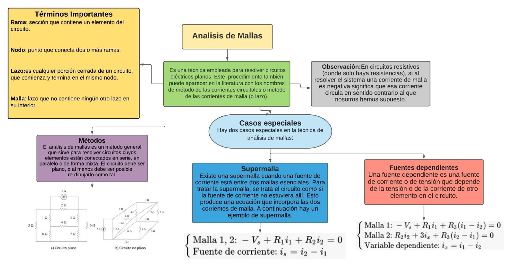
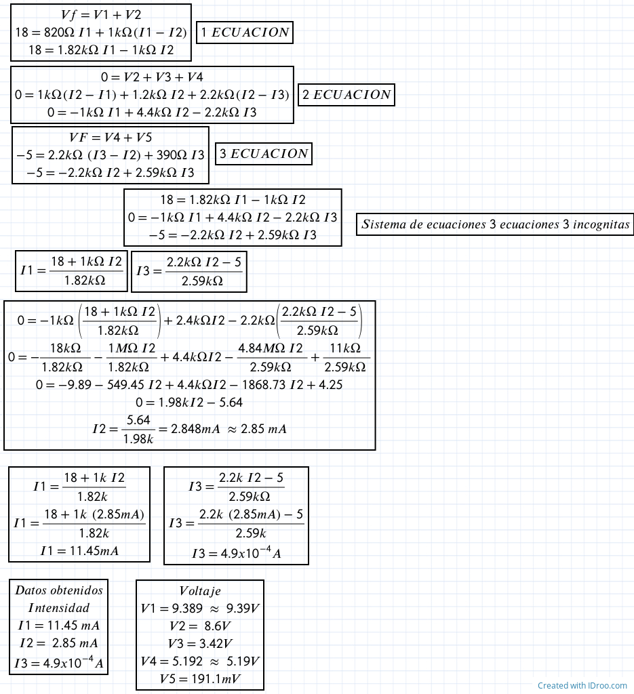

------------
 **Asignatura:**  Fundamentos de Circuitos Eléctricos 
                          
 **Docente:**     Ing. Darwin Alulema            
                    
 **Integrantes:** Mera Erick, Quilumbaquin Lenin, Vallejo Keily
                  
 **Semestre:**    Segundo
 
 **Parcial:**     1
 
 **Laboratorio Nro:**     2
 
------------
## **TEMA:**  Análisis de Mallas
------------

 1. **OBJETIVOS**

    #### Objetivo General:

     - Determinar mediante la ley de voltajes de Kirchhoff la corriente en un circuito eléctrico. 

    #### Objetivos Específicos:

     - Calcular el valor de la corriente del circuito mediante el análisis de mallas. 
     - Aplicar un sentido de corriente arbitrario (horario o antihorario) para todas las mallas.
     - Comprender la importancia que tiene el análisis de mallas al analizar circuitos electrónicos para realizar cálculos de una manera más fácil y organizadA.

2. **MARCO TEÓRICO (RESUMEN)**

      
      

3. **EXPLICACIÓN Y RESOLUCIÓN DE EJERCICIOS O PROBLEMAS** 

      
      - MATERIAL

      

      - PROCEDIMIENTO

      3.1 Implemente el circuito que se presenta en la figura 2.1.

      

      3.2 Medición de cada una de las corrientes de las malla.

      
      
 
      3.3 Uso del simulador Tinkercad para el circuito de la figura 2.1, obteniendo los valores de las corrientes de las mallas.
      
      
      

      Tabala 3.4 Resultados obtenidos para el circuito de la figura 2.1.

      |MALLA  |  RESULTADOS ANALÍTICOS  |  RESULTADOS SIMULADOS |
      | ------------ | ------------ | ------------ |
      | 1 (11.5 mA) | R1=9.39 V  ; R2= 8.6 V| R1=9.39 V ; R2= 8.61 V  |
      | 2 ( 2.85 mA ) | R2=8.6 V  ; R3= 3.42 V ; R4= 5.19 V | R2=8.61 V ; R3= 3.42 V ; R4= 5.19 V |
      | 3 (4.0 x 10^-4 A) |  R4= 5.19 V  ; R5= 191.1 mV | R4= 5.19 V ;  R5= 190 mV  |
      
      Tabala 3.5 Porcentaje de Error.
      
      |MALLA 3  (4.0 x 10^-4 A) |  % de Error  |
      | ------------ | ------------ |
      |  R4= 5.19 V ; R5= 191.1 mV | R4= 0% ; R5= -0.58%   |
     
      

4. **VIDEO**

      [Análisi de Mallas ](   " Análisi de Mallas ")

  
5. **CONCLUSIONES**

      
      - En esta práctica de laboratorio se calculó el valor de la corriente del circuito mediante LVK. A la hora de realizar los respectivos cálculos en la práctica de laboratorio se evidencio que con el análisis de mallas se puede ir calculando el circuito en varias partes y lograr resolverlo de una manera más fácil.
 
      - Se aplicó un sentido horaio de corriente para todas las mallas por conveniencia, pero indistintamente del sentido se obtiene los mismos valores. 

6. **BIBLIOGRAFÍA**
   
    eduMedia. (2021). Leyes de kirchhoff. Obtenido de: https://www.edumedia-sciences.com/es/media/510-leyes-de-kirchhoff

    Ramirez, A. (2019). Leyes de kirchhoff. Obtenido de: https://d1wqtxts1xzle7.cloudfront.net/63362670/Leyes_de_Kirchhoff20200519-84014-3f6yxn-with-cover-page.pdf?        
    

   
   
  
 
