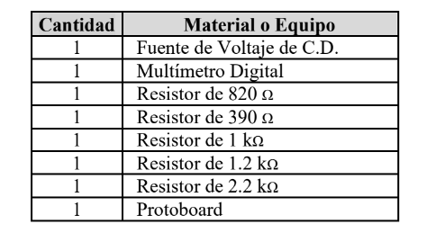
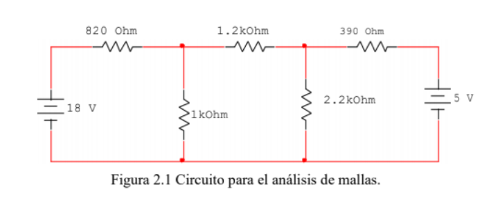

------------
 **Asignatura:**  Fundamentos de Circuitos Eléctricos 
                          
 **Docente:**     Ing. Darwin Alulema            
                    
 **Integrantes:** Mera Erick, Quilumbaquin Lenin, Vallejo Keily
                  
 **Semestre:**    Segundo
 
 **Parcial:**     1
 
 **Laboratorio Nro:**     2
 
------------
## **TEMA:**  Análisis de Mallas
------------

 1. **OBJETIVOS**

#### Objetivo General:

 - Determinar mediante la ley de voltajes de Kirchhoff la corriente en un circuito eléctrico. 

#### Objetivos Específicos:

 - Calcular el valor de la corriente del circuito mediante el análisis de mallas. 
 - Aplicar un sentido de corriente arbitrario (horario o antihorario) para todas las mallas.
 -  l

2. **MARCO TEÓRICO (RESUMEN)**

  MATERIAL
  
  
  
  PROCEDIMIENTO
  
  
  
  
  

3. **EXPLICACIÓN Y RESOLUCIÓN DE EJERCICIOS O PROBLEMAS** 

|MALLA  |  RESULTADOS ANALÍTICOS  |  RESULTADOS SIMULADOS |
| ------------ | ------------ | ------------ |
|   |   |   |
|   |   |   |
|   |   |   |

4. **VIDEO**

5. **CONCLUSIONES**

  - En esta práctica de laboratorio se calculó el valor de la corriente del circuito mediante LVK. 
  - Se aplicó un sentido horaio de corriente para todas las mallas. 

7. **VIDEO**
